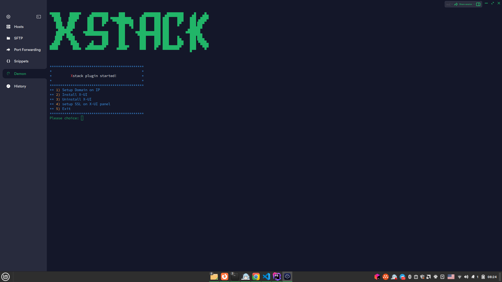

<div align="center">

</div>


# V2ray-Script

+ Mit diesem Skript können Sie v2ray einfach installieren und SSL auf dem x-ui-Panel einstellen
+ Mit Hilfe dieses Skripts können Sie die Domain mit IP setzen

## Sprache
<div align="center">

[](https://github.com/4xmen/xstack-v2ray-installer/blob/main/README.md) &nbsp;&nbsp;&nbsp;&nbsp;&nbsp;&nbsp;&nbsp;&nbsp;&nbsp;&nbsp;&nbsp;&nbsp;&nbsp;&nbsp;&nbsp;&nbsp;&nbsp;&nbsp;&nbsp;&nbsp;&nbsp;&nbsp;&nbsp;&nbsp;&nbsp;&nbsp;&nbsp;&nbsp;&nbsp;&nbsp;&nbsp;&nbsp;&nbsp;&nbsp;&nbsp;&nbsp;&nbsp;&nbsp;&nbsp;&nbsp;&nbsp;&nbsp;&nbsp;&nbsp;&nbsp;&nbsp;
[]([https://github.com/4xmen/v2ray-script/blob/master/README.fa.md](https://github.com/4xmen/xstack-v2ray-installer/blob/main/README.fa.md)) &nbsp;&nbsp;&nbsp;&nbsp;&nbsp;&nbsp;&nbsp;&nbsp;&nbsp;&nbsp;&nbsp;&nbsp;&nbsp;&nbsp;&nbsp;&nbsp;&nbsp;&nbsp;&nbsp;&nbsp;&nbsp;&nbsp;&nbsp;&nbsp;&nbsp;&nbsp;&nbsp;&nbsp;&nbsp;&nbsp;&nbsp;&nbsp;&nbsp;&nbsp;&nbsp;&nbsp;&nbsp;&nbsp;&nbsp;&nbsp;&nbsp;&nbsp;&nbsp;&nbsp;&nbsp;&nbsp;
[]([https://github.com/4xmen/v2ray-script/blob/master/README.de.md](https://github.com/4xmen/xstack-v2ray-installer/blob/main/README.de.md))

</div>

## Wie benutzt man

Um dieses Skript zu verwenden, müssen Sie den folgenden Befehl ausführen

```shell
wget https://raw.githubusercontent.com/4xmen/v2ray-script/main/vmess-upstream-installer.sh
chmod +x xstack-installer.sh
./xstack-installer.sh
```

## 

## Screenshots

<div align="center">

</div>

## Abzeichen

<div align="center">

[](https://github.com/4xmen/v2ray-script) &nbsp;&nbsp;&nbsp;
[](https://choosealicense.com/licenses/GPL/) &nbsp;&nbsp;&nbsp;
[](https://Github.com/Xstack) &nbsp;&nbsp;&nbsp;
[](https://Github.com/4xmen) &nbsp;&nbsp;&nbsp;

</div>

## 🔗 Verknüpfungen

https://Github.com/4xmen
<br>
https://Xstack.ir

## Merkmale

- Einfacher zu bedienen
- Kompatibel mit allen Linux-Distributionen


## Lizenz

 [](https://opensource.org/licenses/)
<br>
 [GPL](https://www.gnu.org/licenses/gpl-3.0.en.html)    


## Einige Fehler melden
Fehler finden Bitte [erstellen Sie ein Problem](https://github.com/4xmen/v2ray-script/issues) und wir werden es gemeinsam für eine bessere Vorlage beheben.

## Unterstützung

Teilen Sie unser Projekt, um uns zu unterstützen :)

<hr>

<div align="center"> Entwickelt mit Liebe für die freie Welt! ❤️</div>


